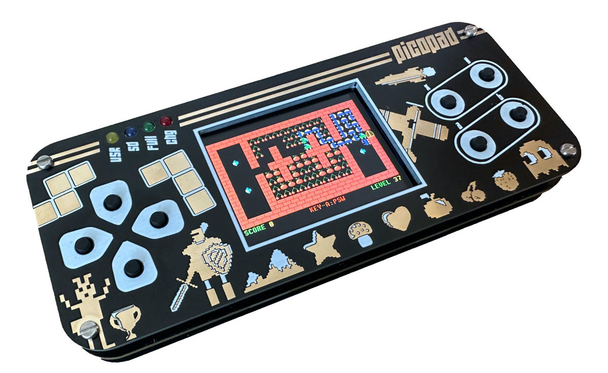
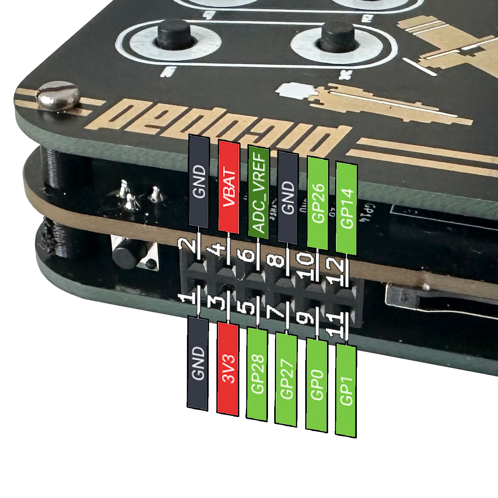

# Picopad
Picopad - open source gaming console based on Raspberry Pi Pico (RP2040)  

## Folder descriptions:

### `hardware`
The `hardware` folder contains schematics and photos of the Picopad.

### `circuitpython`
The `circuitpython` folder contains libraries and examples for CircuitPython.

### `micropython`
The `micropython` folder contains libraries and examples for MicroPython.

### `PicoLibSDK`
The `PicoLibSDK` folder contains an alternative extended C/C++ SDK library for the Raspberry Pico.

## External connector
The console also features an external connector that provides battery power, 3.3V, and GND. It supports communication through UART, has two I2C interfaces, three analog inputs, and six GPIO pins.

## License
GNU GENERAL PUBLIC LICENSE
Version 3, 29 June 2007

Permissions:
- You are free to use, modify, and distribute this software.
- You can run the program for any purpose.
- You can study how the program works and make changes to it.
- You can distribute copies of the software to others.
- You can distribute modified versions of the software.

Conditions:
- You must include the original copyright notice and license text with every copy of the software.
- If you modify the software and distribute it, you must provide access to the modified source code under the same license.

Limitations:
- The license does not provide any warranty or guarantee for the software.
- The licensor is not liable for any damages or legal issues caused by the use or distribution of the software.
- Some additional terms and conditions may apply, depending on the specific software.

For a full and legally binding version of the GNU GENERAL PUBLIC LICENSE Version 3, please refer to the license text provided in the LICENSE file.

